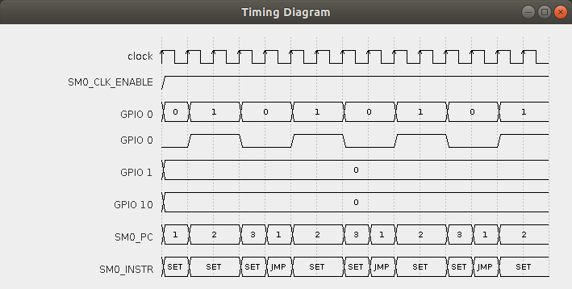

# RP2040 PIO Emulator

An emulator of the RP2040 state machines.
This emulator is _not_ intended as a real-time emulation of the actual
hardware, but as a handy tool for understanding how the PIO works and
for testing and debugging when developing code for the PIO.

For detailed information, see [the full docs on readthedocs.io][1]

## Motivation

What is the purpose of an RP2040 emulator if you can easily use the
original?  There are a number of good reasons for doing so:

* To be able to trace / single step a PIO program as an invaluable aid
  for developing and debugging, which is not easily possible directly
  on the RP2040 hardware.

* To inspect all of the PIO's internal state while developing and
  debugging a PIO program.  This feature applies even to those parts
  of the PIO that are not accessible when running on real RP2040
  hardware, such as:

  * the contents of PIO registers X, Y, ISR and OSR,

  * the current value of the ISR / OSR shift count or

  * the number of an instruction's pending delays.

  In contrast, the emulator has access to the PIO's complete internal
  logical state (otherwise, the emulation could not correctly work).

* To debug your PIO program in the context of your IDE: The emulator
  will typically run on your development host machine.  That is, there
  is no need to upload the PIO program to a real RPI2040 for each and
  every tiny change, thus saving time and stress in the course of
  small and frequent development cycles.

* To be able to automatically generate detailed timing diagrams
  straight from an emulated run of a PIO program.  Timing diagrams are
  highly useful for debugging as well as for documentation, as proof
  of concept or fact sheet.  The selection of signals shown on the
  diagram is freely configurable.

* To be able to debug a PIO program even if there is no RP2040
  hardware at hand.  (Fun fact: The RP2040 is still sold out at all of
  the distributors easily accessible to me.  That is, I still do not
  own an RP2040 of my own, but solely have to rely on the specs and
  other sources of documentation.)

* A motivation that applies to me personally: If I succeed in
  implementing a (more or less) correctly working emulation of the
  PIO, than I am somewhat confident that I have basically understood
  how the PIO works and what capabilities it has when it comes to
  writing PIO programs for it.

## Current Features

* The core PIO emulator is already running, though it has not yet been
extensively tested.  That is, there are surely still many bugs in the
emulation, such that emulation may behave wrong, especially for
programs that use more exotic and therefore not well tested features
of the PIO.

* The emulator can be used to automatically generate timing diagrams.
However, configuration is still hard-wired in the source code (in the
```run()``` method of class ```org.soundpaint.rp2040pio.Main```).
With one of the next commits, flexible configuration and program
loading will be made possible through a configuration file and/or via
command line arguments, rather than having to recompile the source
code of the emulator.  Since there are surely still lots of bugs in
the emulation, note that, as of now, the generated timing diagrams may
be faulty as well.

<p>
  <figure>
    <a href="doc/screenshots/squarewave_1.png">
      
    </a>
    <br />
    <figcaption>
      Fig. 1: Timing Diagram Generated from Emulation of
      <code>squarewave</code> Program
    </figcaption>
  </figure>
</p>

## Future Plans

A command line based monitor program will be provided to
interactively:

* load programs,
* list (unassemble) program code,
* modify programs,
* start / stop / synchronize state machines,
* single step / trace into programs,
* define break points,
* inspect current contents of state machine registers, GPIO pins, FIFO
  registers, shift registers, etc.
* manipulate the current contents of registers and pins,
* generate timing diagrams,

and more.

Maybe, I will also provide a graphical user interface that depicts the
internal state of the PIO in a graphical and more vivid manner.

* Support for interaction with the PIO's outer world.  In particular:

  * Support specifying when and which logical values will be put onto
    the GPIO pins from an external source.

  * Support specifying when and which values will be shifted into the
    TX FIFO or shifted out from the RX FIFO via DMA access onto the
    PIO.

  * Support specifying when and which operations are triggered by
    DMA access onto the PIO memory-mapped registers.

  * Support specifying when and which instructions are inserted by
    DMA access onto the PIO memory-mapped SMx_INSTR registers.

  * Support specifying when an interrupt is requested by DMA access
    onto the PIO memory-mapped interrupt registers.

* Generate a warning whenever a race condition is detected.  In
  particular, generate a warning when multiple state machines
  concurrently access the same resource, like writing simultaneously
  to the same GPIO pin.  Warnings can be reported in the monitor
  program while debugging a program, as well as marked on the timing
  diagram.

* Generate a warning upon FIFO overflow / underflow.

* Generate a warning when reading from or writing to a GPIO pin that
  has pin direction that conflicts with the type of access.

* When generating a timing diagram, support alternative backends such
  as PDF or SVG.

* If an alternative backend for timing diagrams provides tooltips, add
  tooltips with additional info such as showing the complete
  instruction (with all of its parameters) when hovering over the
  instruction mnemonic in the timing diagram.

* Also add tooltips with descriptive / explanatory text for all
  warnings, where appropriate.

<!-- References -->

[1]: https://rp2040pio-docs.readthedocs.io/
